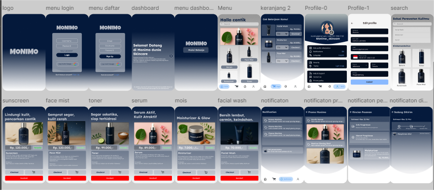

# Monimo – Skincare Ordering App (UI/UX Design)

Monimo is a UI/UX design project for a skincare ordering application, created using Figma.  
The interface uses a bold and elegant deep navy theme (#04193B) to give a premium and trustworthy feel, perfect for modern skincare brands.

🔗 [View Figma Design](https://www.figma.com/design/jYh3NtFUUPe0k6ZovyKy4G/APLIKASI-MONIMO?node-id=1-13&t=4ZpOiLPYfU7syz38-1)

## Features
- Clean home page with featured skincare highlights
- Detailed product screen with modern layout
- Shopping cart & streamlined checkout flow
- Color scheme: #04193B (deep navy), white, and accent colors
- Responsive-ready UI layout

## Design Overview
- Designed in *Figma* with reusable components
- Uses *auto layout, *grids*, and *typographic hierarchy*
- Dark elegance theme: evokes calm, premium, and trust

## 
